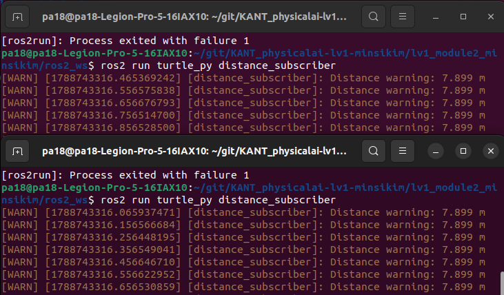
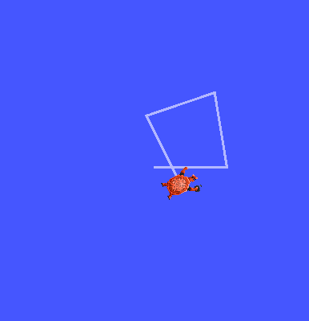
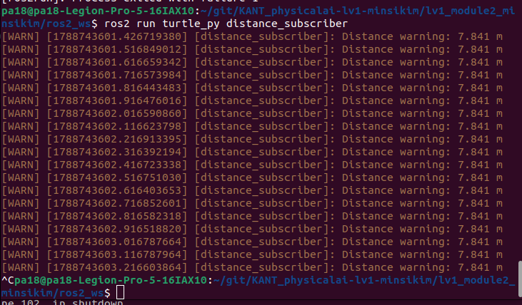
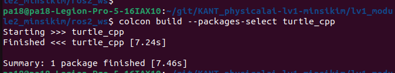
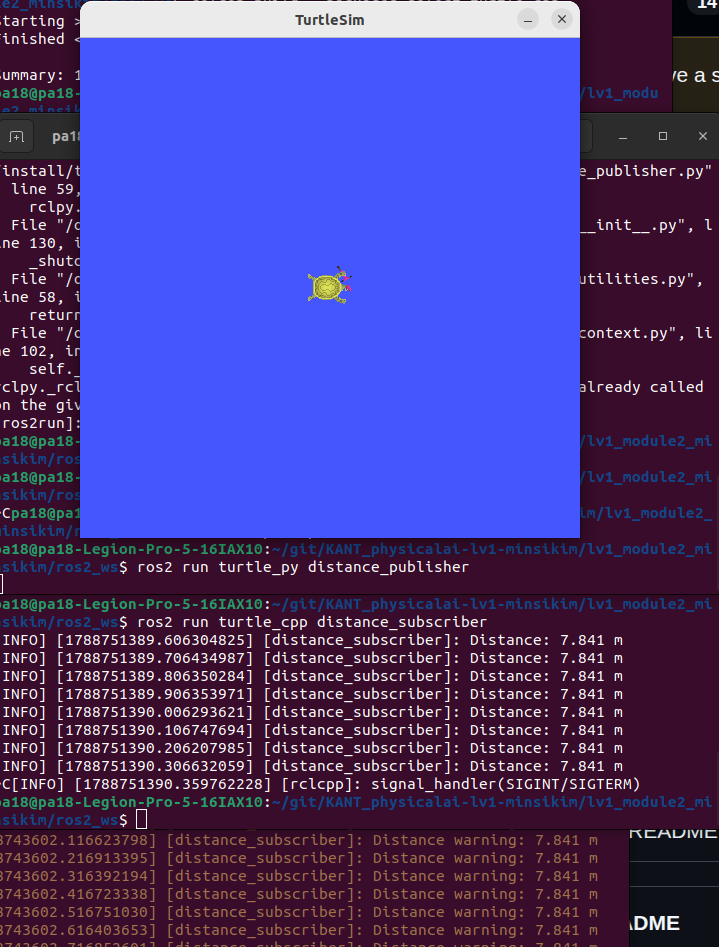

# 문제1. C++ 빌드 체계 세우기 — g++ 다중 파일 빌드와 CMake 전환
답안 템플릿
- 수동 2단계 빌드 명령 (터미널 입력)
- undefined reference 에러 메시지 (출력) — 컴파일 에러와의 차이 설명
컴파일 에러는 main.cpp -> main.o 컴파일 단계에서 에러가 나는것이고, 링크에러는 .o파일들의 링크단계에서 필요한 함수를 찾지못해 생기는 에러이다.
```
s$ g++ main.o -o motor
/usr/bin/ld: main.o: in function `main':
main.cpp:(.text+0x24): undefined reference to `Motor::Motor()'
/usr/bin/ld: main.cpp:(.text+0x3c): undefined reference to `Motor::SetSpeed(double)'
/usr/bin/ld: main.cpp:(.text+0x64): undefined reference to `Motor::GetSpeed()'
collect2: error: ld returned 1 exit status
```
- CMake 빌드 출력 (터미널 출력)
```
$ cd build
$ cmake ..
-- The C compiler identification is GNU 11.4.0
-- The CXX compiler identification is GNU 11.4.0
-- Detecting C compiler ABI info
-- Detecting C compiler ABI info - done
-- Check for working C compiler: /usr/bin/cc - skipped
-- Detecting C compile features
-- Detecting C compile features - done
-- Detecting CXX compiler ABI info
-- Detecting CXX compiler ABI info - done
-- Check for working CXX compiler: /usr/bin/c++ - skipped
-- Detecting CXX compile features
-- Detecting CXX compile features - done
-- Configuring done
-- Generating done
-- Build files have been written to: /home/pa18/git/KANT_physicalai-lv1-minsikim/lv1_module2_김민식/cpp_basics/build
```

```
$ make
[ 33%] Building CXX object CMakeFiles/motor_app.dir/main.cpp.o
[ 66%] Building CXX object CMakeFiles/motor_app.dir/motor.cpp.o
[100%] Linking CXX executable motor_app
[100%] Built target motor_app
```
- 증분 빌드 시 재컴파일된 파일: motor.cpp — 판단 근거
motor.cpp.o파일만 빌딩하는 로그 확인
```
$ make
Consolidate compiler generated dependencies of target motor_app
[ 33%] Building CXX object CMakeFiles/motor_app.dir/motor.cpp.o
[ 66%] Linking CXX executable motor_app
[100%] Built target motor_app
```

# 문제3. rclpy 노드 작성 — 거북이 상태 발행자와 구독자
## 답안 템플릿
- /turtle1/pose 필드 구성:
```
x: 5.544444561004639
y: 5.544444561004639
theta: 0.0
linear_velocity: 0.0
angular_velocity: 0.0
```
- ros2 topic hz /turtle_distance 출력: 평균 10.000 Hz
```
average rate: 9.998
min: 0.100s max: 0.100s std dev: 0.00016s window: 12
```
- 구독자 경고 로그 (터미널 출력)
```
[WARN] [1788706472.126889766] [distance_subscriber]: Distance warning: 7.841 m
```
1. 구독자 2개 동시 수신 확인 (양쪽 로그)

2. 정사각형 주행 캡처 (turtlesim 화면)

3. Ctrl+C 정상 종료 화면 (출력)

# 4. rclcpp 노드 작성 — C++ 발행자와 구독자
## 답안 템플릿
1. colcon build 성공 출력

2. rclpy 발행에서 rclcpp 구독으로 이어진 로그

3. rclpy와 rclcpp 대응 관계표 — 노드 생성 / 타이머 / 콜백 / 종료 (4행)

|기능|rclpy(Python)|rclcpp(C++)|
|---|---|---|
|노드 생성|rclpy.node에서 Node상속, super().__init__('name')|rclcpp::Node상속, 생성자 상속에 Node('name')|
|타이머|create_timer(주기,콜백)|create_wall_timer(주기, 콜백)|
|콜백|create_subscription(메세지타입,토픽,콜백,큐깊이)|create_subscription<메세지타입>(토픽,큐깊이,콜백)|
|종료|rclpy.shutdown()|rclcpp::shutdown()|

# 5. Service 와 Action — 즉시 응답과 장기 작업
답안 템플릿
- 호출한 내장 서비스와 타입 — 4행 표 (서비스 / 타입 / 요청 값 / 결과)

|서비스|/spawn|
|---|---|
|타입|turtlesim/srv/Spawn|
|요청 값|```float32 x float32 y float32 theta string name # Optional.  A unique name will be created and returned if this is empty```|
|결과|string name|

- Service 요청·응답 로그
- 데드락이 생기는 이유 — executor 관점 3줄 이내 서술
응답은 익스큐터를 통해 오기때문에 요청이 오면 익스큐터는 콜백을 기다리고 콜백은 응답을 기다리기 때문에 데드락이 생긴다.
- rotate_absolute 피드백 수신 로그 — remaining 이 줄어드는 흐름
```
$ ros2 run turtle_py rotate_client
[INFO] [1789039711.212998492] [rotate_client]: 회전 목표 전송: 1.57 rad
[INFO] [1789039711.227716314] [rotate_client]: 남은 회전량: 1.571 rad
[INFO] [1789039711.228082162] [rotate_client]: Goal이 승인되었습니다.
[INFO] [1789039711.243169430] [rotate_client]: 남은 회전량: 1.555 rad
[INFO] [1789039711.259858172] [rotate_client]: 남은 회전량: 1.539 rad
[INFO] [1789039711.275632020] [rotate_client]: 남은 회전량: 1.523 rad
[INFO] [1789039711.291176913] [rotate_client]: 남은 회전량: 1.507 rad
[INFO] [1789039711.306924305] [rotate_client]: 남은 회전량: 1.491 rad
[INFO] [1789039711.323919962] [rotate_client]: 남은 회전량: 1.475 rad
[INFO] [1789039711.339150420] [rotate_client]: 남은 회전량: 1.459 rad
[INFO] [1789039711.355831185] [rotate_client]: 남은 회전량: 1.443 rad
[INFO] [1789039711.371212596] [rotate_client]: 남은 회전량: 1.427 rad
[INFO] [1789039711.387877680] [rotate_client]: 남은 회전량: 1.411 rad
[INFO] [1789039711.403474275] [rotate_client]: 남은 회전량: 1.395 rad
[INFO] [1789039711.419492067] [rotate_client]: 남은 회전량: 1.379 rad
[INFO] [1789039711.435004505] [rotate_client]: 남은 회전량: 1.363 rad
[INFO] [1789039711.451727146] [rotate_client]: 남은 회전량: 1.347 rad
[INFO] [1789039711.467843307] [rotate_client]: 남은 회전량: 1.331 rad
[INFO] [1789039711.483702284] [rotate_client]: 남은 회전량: 1.315 rad
[INFO] [1789039711.499682949] [rotate_client]: 남은 회전량: 1.299 rad
[INFO] [1789039711.515172885] [rotate_client]: 남은 회전량: 1.283 rad
[INFO] [1789039711.531001525] [rotate_client]: 남은 회전량: 1.267 rad
[INFO] [1789039711.548172887] [rotate_client]: 남은 회전량: 1.251 rad
[INFO] [1789039711.563766634] [rotate_client]: 남은 회전량: 1.235 rad
[INFO] [1789039711.579639267] [rotate_client]: 남은 회전량: 1.219 rad
[INFO] [1789039711.595941219] [rotate_client]: 남은 회전량: 1.203 rad
[INFO] [1789039711.611675011] [rotate_client]: 남은 회전량: 1.187 rad
[INFO] [1789039711.627623696] [rotate_client]: 남은 회전량: 1.171 rad
[INFO] [1789039711.643132427] [rotate_client]: 남은 회전량: 1.155 rad
[INFO] [1789039711.659873954] [rotate_client]: 남은 회전량: 1.139 rad
[INFO] [1789039711.675847830] [rotate_client]: 남은 회전량: 1.123 rad
[INFO] [1789039711.691520354] [rotate_client]: 남은 회전량: 1.107 rad
[INFO] [1789039711.707377732] [rotate_client]: 남은 회전량: 1.091 rad
[INFO] [1789039711.723256927] [rotate_client]: 남은 회전량: 1.075 rad
[INFO] [1789039711.739082127] [rotate_client]: 남은 회전량: 1.059 rad
[INFO] [1789039711.755909790] [rotate_client]: 남은 회전량: 1.043 rad
[INFO] [1789039711.771793785] [rotate_client]: 남은 회전량: 1.027 rad
[INFO] [1789039711.787729673] [rotate_client]: 남은 회전량: 1.011 rad
[INFO] [1789039711.803391834] [rotate_client]: 남은 회전량: 0.995 rad
[INFO] [1789039711.819298522] [rotate_client]: 남은 회전량: 0.979 rad
[INFO] [1789039711.835410960] [rotate_client]: 남은 회전량: 0.963 rad
[INFO] [1789039711.851185421] [rotate_client]: 남은 회전량: 0.947 rad
[INFO] [1789039711.867160398] [rotate_client]: 남은 회전량: 0.931 rad
[INFO] [1789039711.883869177] [rotate_client]: 남은 회전량: 0.915 rad
[INFO] [1789039711.899749381] [rotate_client]: 남은 회전량: 0.899 rad
[INFO] [1789039711.915645917] [rotate_client]: 남은 회전량: 0.883 rad
[INFO] [1789039711.931544486] [rotate_client]: 남은 회전량: 0.867 rad
[INFO] [1789039711.947449550] [rotate_client]: 남은 회전량: 0.851 rad
[INFO] [1789039711.963105498] [rotate_client]: 남은 회전량: 0.835 rad
[INFO] [1789039711.979631542] [rotate_client]: 남은 회전량: 0.819 rad
[INFO] [1789039711.995726208] [rotate_client]: 남은 회전량: 0.803 rad
[INFO] [1789039712.011412743] [rotate_client]: 남은 회전량: 0.787 rad
[INFO] [1789039712.028083910] [rotate_client]: 남은 회전량: 0.771 rad
[INFO] [1789039712.043988444] [rotate_client]: 남은 회전량: 0.755 rad
[INFO] [1789039712.059532635] [rotate_client]: 남은 회전량: 0.739 rad
[INFO] [1789039712.075978043] [rotate_client]: 남은 회전량: 0.723 rad
[INFO] [1789039712.091317595] [rotate_client]: 남은 회전량: 0.707 rad
[INFO] [1789039712.107895354] [rotate_client]: 남은 회전량: 0.691 rad
[INFO] [1789039712.123455785] [rotate_client]: 남은 회전량: 0.675 rad
[INFO] [1789039712.139127639] [rotate_client]: 남은 회전량: 0.659 rad
[INFO] [1789039712.155728847] [rotate_client]: 남은 회전량: 0.643 rad
[INFO] [1789039712.171496414] [rotate_client]: 남은 회전량: 0.627 rad
[INFO] [1789039712.187123736] [rotate_client]: 남은 회전량: 0.611 rad
[INFO] [1789039712.202909441] [rotate_client]: 남은 회전량: 0.595 rad
[INFO] [1789039712.219627426] [rotate_client]: 남은 회전량: 0.579 rad
[INFO] [1789039712.235395317] [rotate_client]: 남은 회전량: 0.563 rad
[INFO] [1789039712.252012113] [rotate_client]: 남은 회전량: 0.547 rad
[INFO] [1789039712.267741819] [rotate_client]: 남은 회전량: 0.531 rad
[INFO] [1789039712.283598167] [rotate_client]: 남은 회전량: 0.515 rad
[INFO] [1789039712.299397305] [rotate_client]: 남은 회전량: 0.499 rad
[INFO] [1789039712.315958059] [rotate_client]: 남은 회전량: 0.483 rad
[INFO] [1789039712.331900068] [rotate_client]: 남은 회전량: 0.467 rad
[INFO] [1789039712.347962788] [rotate_client]: 남은 회전량: 0.451 rad
[INFO] [1789039712.363847470] [rotate_client]: 남은 회전량: 0.435 rad
[INFO] [1789039712.379487763] [rotate_client]: 남은 회전량: 0.419 rad
[INFO] [1789039712.395437645] [rotate_client]: 남은 회전량: 0.403 rad
[INFO] [1789039712.411322624] [rotate_client]: 남은 회전량: 0.387 rad
[INFO] [1789039712.427196953] [rotate_client]: 남은 회전량: 0.371 rad
[INFO] [1789039712.443846572] [rotate_client]: 남은 회전량: 0.355 rad
[INFO] [1789039712.459161293] [rotate_client]: 남은 회전량: 0.339 rad
[INFO] [1789039712.475844054] [rotate_client]: 남은 회전량: 0.323 rad
[INFO] [1789039712.491450436] [rotate_client]: 남은 회전량: 0.307 rad
[INFO] [1789039712.507820128] [rotate_client]: 남은 회전량: 0.291 rad
[INFO] [1789039712.523259104] [rotate_client]: 남은 회전량: 0.275 rad
[INFO] [1789039712.539943363] [rotate_client]: 남은 회전량: 0.259 rad
[INFO] [1789039712.555406730] [rotate_client]: 남은 회전량: 0.243 rad
[INFO] [1789039712.571924078] [rotate_client]: 남은 회전량: 0.227 rad
[INFO] [1789039712.587437426] [rotate_client]: 남은 회전량: 0.211 rad
[INFO] [1789039712.602959322] [rotate_client]: 남은 회전량: 0.195 rad
[INFO] [1789039712.619614054] [rotate_client]: 남은 회전량: 0.179 rad
[INFO] [1789039712.635615222] [rotate_client]: 남은 회전량: 0.163 rad
[INFO] [1789039712.651438089] [rotate_client]: 남은 회전량: 0.147 rad
[INFO] [1789039712.666951681] [rotate_client]: 남은 회전량: 0.131 rad
[INFO] [1789039712.683536250] [rotate_client]: 남은 회전량: 0.115 rad
[INFO] [1789039712.699259606] [rotate_client]: 남은 회전량: 0.099 rad
[INFO] [1789039712.715880720] [rotate_client]: 남은 회전량: 0.083 rad
[INFO] [1789039712.731810894] [rotate_client]: 남은 회전량: 0.067 rad
[INFO] [1789039712.747980483] [rotate_client]: 남은 회전량: 0.051 rad
[INFO] [1789039712.763709253] [rotate_client]: 남은 회전량: 0.035 rad
[INFO] [1789039712.779930765] [rotate_client]: 남은 회전량: 0.019 rad
[INFO] [1789039712.780478961] [rotate_client]: 회전 완료 - 실제 회전량: -1.552 rad
```
- 취소 요청 처리 로그 — 취소 시점 각도: theta: 0.4959999918937683
```
[INFO] [1789040130.160960687] [rotate_client]: Goal 취소 요청
[INFO] [1789040130.164116731] [rotate_client]: Goal 취소 성공
```
- 통신 패턴 설계표 — 기능 / 선택한 모델 / 근거 (5행)

|기능| 선택한 모델 | 근거|
|---|---|---|
|현재 거북이 위치 조회|Topic|위치 정보가 지속적으로 발행되는 데이터이므로|
|거북이와 원점의 거리 전달|Topic|계산된 거리값을 주기적으로 전달해야 하므로|
|거리계산 주기 변경|Service|요청을 받으면 즉시 설정값을 변경하고 결과를 반환해야 하므로|
|거북이를 특정 각도로 회전|Action|회전에 시간이 걸리고 진행 상황을 피드백으로 확인할수있으므로|
진행중인 회전 작업 취소|Action|실행중인 장기 작업에 대해 Cancel요청을 지원해야 하므로|


```
ros2 service list
/clear
/kill
/reset
/spawn
/turtle1/set_pen
/turtle1/teleport_absolute
/turtle1/teleport_relative
/turtlesim/describe_parameters
/turtlesim/get_parameter_types
/turtlesim/get_parameters
/turtlesim/list_parameters
/turtlesim/set_parameters
/turtlesim/set_parameters_atomically
```
```
$ ros2 service type /turtle1/teleport_absolute
turtlesim/srv/TeleportAbsolute
```
```
$ ros2 service type /turtle1/set_pen
turtlesim/srv/SetPen
```
```
$ ros2 service type /spawn
turtlesim/srv/Spawn
```
```
$ ros2 service type /clear
std_srvs/srv/Empty
```
*---로 요청(Request)과 응답(Response) 구분
```
$ ros2 interface show turtlesim/srv/TeleportAbsolute
float32 x
float32 y
float32 theta
---
```

```
$ ros2 interface show turtlesim/srv/SetPen
uint8 r
uint8 g
uint8 b
uint8 width
uint8 off
---
```

```
s$ ros2 interface show turtlesim/srv/Spawn
float32 x
float32 y
float32 theta
string name # Optional.  A unique name will be created and returned if this is empty
---
string name
```

```
$ ros2 interface show std_srvs/srv/Empty
---
```
